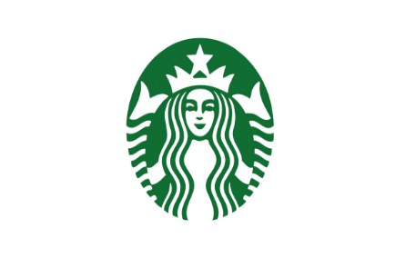

# Starbucks-Capstone-Challenge-DSND

## 1. Libraries :
This project was written in Python, using Jupyter Notebook on Anaconda. The relevant Python packages for this project are as follows:

pandas
numpy
math
json
sklearn.model_selection (train_test_split module)
sklearn.preprocessing (StandardScaler, PolynomialFeatures)
from sklearn.tree (DecisionTreeClassifier,DecisionTreeRegressor)
sklearn.ensemble (RandomForestClassifier)
sklearn.metrics (mean_squared_error,classification_report)
sklearn.linear_model (Ridge)
time
sklearn.model_selection (GridSearchCV)
matplotlib

[MEDIUM Blog](https://medium.com/@birajdarshivam11/predict-effective-offers-for-starbucks-app-users-74c68649fac7?sk=3293a9e18a06a41a220ac58b53caf862)

## 2. JSON Files :
  1. portfolio.json
  2. profile.json
  3. transcript.json
  
  The data is contained in three files:

portfolio.json - containing offer ids and meta data about each offer (duration, type, etc.)
profile.json - demographic data for each customer
transcript.json - records for transactions, offers received, offers viewed, and offers completed
Here is the schema and explanation of each variable in the files:

### portfolio.json

  id (string) - offer id
  offer_type (string) - type of offer ie BOGO, discount, informational
  difficulty (int) - minimum required spend to complete an offer
  reward (int) - reward given for completing an offer
  duration (int) - time for offer to be open, in days
  channels (list of strings)
  
### profile.json

  age (int) - age of the customer
  became_member_on (int) - date when customer created an app account
  gender (str) - gender of the customer (note some entries contain 'O' for other rather than M or F)
  id (str) - customer id
  income (float) - customer's income
  
### transcript.json

  event (str) - record description (ie transaction, offer received, offer viewed, etc.)
  person (str) - customer id
  time (int) - time in hours since start of test. The data begins at time t=0
  value - (dict of strings) - either an offer id or transaction amount depending on the record
  
## 3. Project Motivation :
This project is the Capstone project of my Data Scientist nanodegree with Udacity. As students in the nanodegree, we have the option to take part in the Starbucks Capstone Challenge. For the challenge, Udacity provided simulated data that mimics customer behavior on the Starbucks rewards mobile app.

In this project, I use the data to answer 2 business questions:

  * a. What are the main drivers of an effective offer on the Starbucks app?
  * b. Could the data provided, namely offer characteristics and user demographics, predict whether a user would take up an offer?
To answer the above 2 questions, I created 3 models for the data on the 3 offer types provided. The three offers are: Buy One Get One Free (BOGO), Discount (discount with purchase), and Informational (provides information about products).

As a brief summary of my findings:

  * For Question 1, the feature importance given by all 3 models were that the tenure of a member is the biggest predictor of the effectiveness of an offer. Further study would be able to indicate what average tenure days would result in an effective BOGO offer.

  * For Question 2,my decision to use 3 separate models to predict the effectiveness of each offer type ended up with good accuracy for the 2 of the models (82.83% for BOGO and 87.35% for discount), while slightly less accurate performance for another informational offers (75.3%). However, I would regard 75% as acceptable in a business setting, as for informational offers, there is no cost involved to inform users of a product. Meanwhile, an 80% and above accuracy in a business setting would be acceptable to show offers to people, even if the model misclassifies a few, the overall revenue increase might justify the few mistakes.

